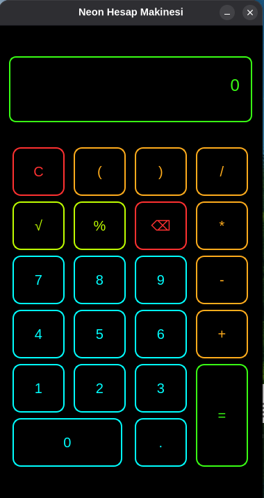
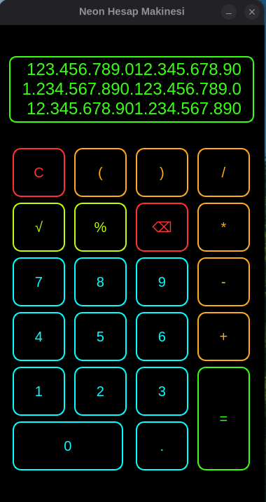
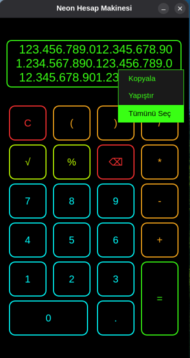

## Ekran Görüntüleri

Neon Hesap Makinesi - Özellikler

* Modern Neon Arayüz: Siyah arka plan üzerine canlı neon renklerle tasarlanmış, şık ve göz yormayan karanlık mod tasarımı.

* Gelişmiş Hassasiyet: Python decimal kütüphanesi kullanılarak 1000 basamağa kadar yüksek hassasiyetli matematiksel hesaplama.

* Dinamik Ekran Tasarımı: Uzun rakamlarda otomatik hizalama ve dikey kaydırmasız temiz metin alanı.

* Akıllı Veri Girişi: Klavye desteği (numpad) ve sağ tık menüsü üzerinden akıllı "Kopyala-Yapıştır" özelliği (yapıştırılan metindeki geçersiz karakterleri otomatik temizler).

* Hata Yönetimi: Tanımsız işlemler veya hatalı girişler için yerleşik "ERROR" ve "TANIMSIZ" uyarı mekanizması.

* Wayland Uyumluluğu: Linux sistemlerde (özellikle Wayland oturumlarında) donma ve ikon sorunlarını önleyen özel yapılandırma.

* Görsel Geri Bildirim: Fare ile üzerine gelindiğinde renk değiştiren (hover) etkileşimli butonlar.

* Otomatik Biçimlendirme: Büyük sayıların okunabilirliğini artırmak için otomatik binlik ayırıcı (nokta) desteği.

-------------------------------------------------------------------------------------------

Kurulum 

Uygulama çalışması için gereken bağımlılık kurulumu : sudo apt install python3-pyqt5 

neon-paket.deb  paketini çift tıklayıp  kurulum yapılabilir . (Bunun için bilgisayarınızda paket kurucu olması lazım)

-------------------------------------------------------------------------------------------

Kurulumsuz Çalıştırma 

neon-calc.py   dosyasını Masaüstüne alınız . Yada istediğiniz bir yere . Fakat nereye taşıdıysanız terminalde kod yazmadan önce  cd  komutu ile taşıdığınız ortama geçiş yapın 

cd Masaüstü  Enter

python3 neon-calc.py   Enter      bu şekilde de kullanabilirsiniz  . 
